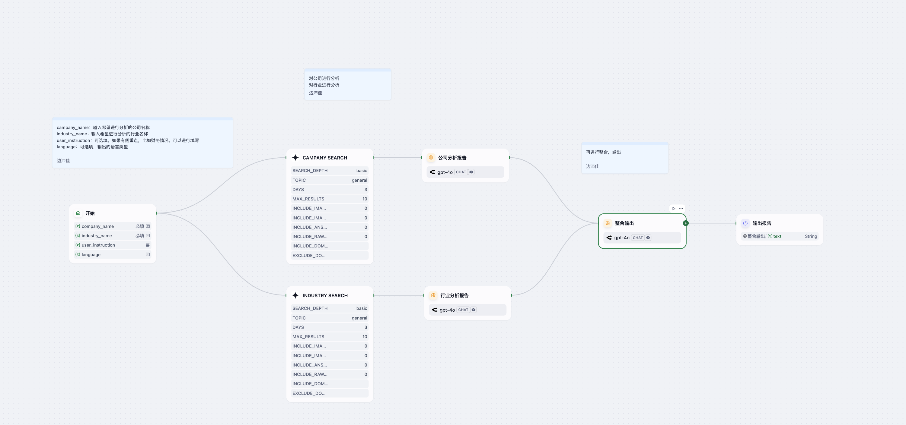

# Client Industry Analysis Agent  
客户行业分析Agent

> 一个基于 Dify 平台的智能 Agent，帮助客户经理快速完成行业与公司双重尽调分析，生成结构化 Markdown 尽调报告。  
> An intelligent Dify-based agent that accelerates client managers’ due-diligence by producing structured Markdown reports covering both industry and company analysis.

---

## 详细介绍 Detailed Introduction

### 背景与意义 Background & Purpose  
在企业授信或投融资场景中，行业尽调和公司分析通常需要大量手动收集资料、整理竞品与宏观数据。这个过程费时耗力，且容易遗漏关键视角。  
**Client Industry Analysis Agent** 致力于：  
- 自动抓取行业与公司公开信息（官网、新闻、数据库、社交媒体）；  
- 分别生成 **行业分析**（现状、特点、趋势）与 **公司分析**（主营业务、经营情况、核心优势、风险因素）；  
- 最后整合输出 **标准 Markdown** 报告，结构清晰、语言正式，适用于授信评审或投后跟踪。  

In corporate lending or investment scenarios, industry and company due-diligence often require extensive manual research across public sites, news and databases. This process is time-consuming and prone to gaps.  
**Client Industry Analysis Agent** aims to:  
- Automatically gather public data on the target industry and company;  
- Produce separate **Industry Analysis** (market status, characteristics, trends) and **Company Analysis** (core business, performance, competitive advantages, risk factors);  
- Finally merge into a **standard Markdown** report, with clear structure and formal language for credit assessment or investment review.

---

## 核心功能 Core Features

1. **多源检索 Multi-Source Retrieval**  
   - 行业搜索 (Industry Search)：根据 `industry_name` 抓取最新市场报告、新闻与数据；  
   - 公司搜索 (Company Search)：根据 `company_name` 获取官网、融资、新闻与公开资料；  

2. **双向分析 Dual Analysis**  
   - **行业分析**：市场规模、增长率、主要参与者、政策环境、技术门槛、竞争格局、发展趋势；  
   - **公司分析**：主营业务与产品、经营指标、核心竞争优势、风险因素；  

3. **整合输出 Merge & Output**  
   - 调用 LLM 对两部分内容进行语义整合；  
   - 生成最终 **Markdown 报告**，包含主标题、行业分析与公司分析两大部分；  
   - 支持中英文输出，由 `language` 参数控制。  

---

## 工作流示意图 Workflow Diagram

---

## 示例输入 Example Input

company_name: 小米汽车
industry_name: 新能源汽车
user_instruction: ""      # 可选：如需关注财务、技术等侧重点
language: zh             # 输出语言：zh / en

## 示例输出 Example Output

# 新能源汽车 - 小米汽车 分析报告

## 行业分析

### 行业现状
新能源汽车行业作为全球低碳转型和碳达峰碳中和目标的重要组成部分，近年来实现了快速发展。目前，中国已成为全球最大的新能源汽车市场，产销量连续多年位居世界第一。根据相关数据，2023年我国新能源汽车产量达到958.7万辆，同比增长35.8%，销量为949.5万辆，渗透率达31.6%。新能源汽车行业已从政策驱动逐步进入市场驱动的稳定发展阶段。

在政策层面，国家出台了《新能源汽车产业发展规划（2021—2035年）》，明确了未来十五年的发展目标，支持新能源汽车技术创新和产业链完善。地方政府也陆续发布优惠政策，包括充电基础设施建设补贴、限牌限行城市免限政策等，进一步助推产业发展。

主要参与者包括比亚迪、蔚来、小鹏、理想等造车新势力，以及传统车企如北汽、吉利等。企业间竞争激烈，各自通过技术创新、品牌升级和国际化布局寻求市场份额。

### 行业特点
1. **产品特性与客户结构**：新能源汽车主要分为纯电动汽车、增程式电动汽车、混合动力汽车及燃料电池汽车。客户结构呈现多元化，既包括私人消费市场，也包括公共交通、物流等领域。  
2. **产业链分布**：行业链条完整，从上游原材料到下游整车装配，各环节国内供应能力强。中国在锂、钴等关键原料加工领域占据全球主导地位。  
3. **技术门槛与壁垒**：核心技术包括动力电池、驱动电机与电控系统，资金与研发门槛高。  
4. **竞争格局**：头部企业集中度高，前十名企业销量占比超85%。国际竞争加剧，传统车企电动化加速。  
5. **供需与价格敏感度**：成本随规模效应下降；消费者对续航、充电和价格高度敏感。

### 行业发展趋势
- **政策与需求驱动**：全球环保目标与碳中和承诺推动市场增长，政策支持力度持续加大。  
- **技术创新**：固态电池、钠离子电池与氢能源技术不断涌现，智能网联与自动驾驶加速应用。  
- **商业模式演进**：电池租赁、车电分离及共享出行等新模式崛起。  
- **国际化**：中国企业加速海外布局，出口与境外建厂持续推进。

---

## 公司分析

### 主营业务及产品
- **核心业务**  
  小米汽车专注智能电动汽车及配套充电网络建设。  
- **主要产品**  
  小米 SU7 系列轿车（标准版/Pro/Max），定位中高端，售价21.6–29.9万元，主打800V高压平台、智能座舱与自动驾驶。  
- **多元化布局**  
  与多家运营商合作接入115万充电桩，布局车载智能设备与车联网服务。

### 经营情况
- **交付与规模**  
  2024年交付13.5万辆，2025年目标30万辆，初期量产表现亮眼。  
- **成本与投入**  
  2024年研发投入130亿元，生产及运营费用300亿元，短期高投入期，需关注规模化后成本回收。  
- **成长潜力与挑战**  
  单月交付破2万辆；面临技术迭代压力与市场竞争加剧。

### 核心竞争优势
- **技术壁垒**：自研超级电机V8s与CTB一体化电池布局全球领先。  
- **品牌与生态**：依托小米集团生态与供应链资源，享流量与成本优势。  
- **生态构建**：打造充电网络、车载设备与软件平台，提升用户粘性。

### 风险因素
- **政策波动**：补贴与限牌政策调整风险。  
- **技术迭代**：未及时跟进新电池与自动驾驶技术或失竞争力。  
- **供应链与成本**：上游原料及芯片短缺可能影响产能与成本。  
- **竞争压力**：传统车企与新势力的市场争夺加剧。

---

