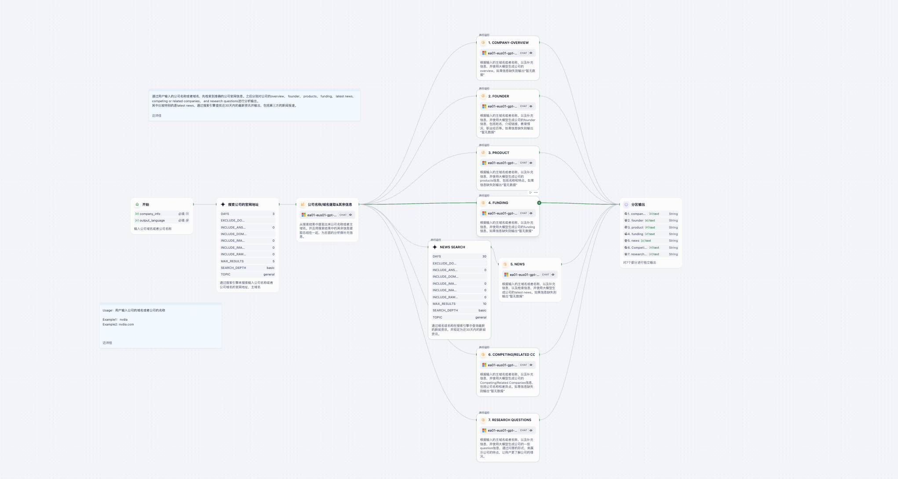

# Company Research Agent

> 一个基于 Dify 平台的智能 Agent，自动调研目标公司并生成结构化报告。  
> An intelligent Dify-based agent that researches a target company and produces a structured report.

---

## 详细介绍 Detailed Introduction

### 背景与意义 Background & Purpose  

在商业与投融资决策中，快速获取一家公司概览、创始团队、产品线、融资历史、最新新闻、竞争格局及研究问题非常重要。  
手动检索和整理这些信息既耗时又容易遗漏关键点。  
**Company Research Agent** 致力于：  
- 自动抓取公司官网、新闻、公开数据库及社交媒体信息；  
- 结构化提取：概览、创始人、产品、融资、新闻、竞争/关联公司、定制研究问题；  
- 以 Markdown 格式输出报告，便于阅读、分享与二次编辑。  

In business and investment decisions, it is crucial to quickly obtain a company’s overview, founding team, product lines, funding history, recent news, competitive landscape, and key research questions.  
Manual research is time-consuming and prone to omissions.  
**Company Research Agent** aims to:  
- Automatically gather data from official websites, news outlets, public databases, and social media;  
- Structure and extract: Overview, Founders, Products, Funding, News, Competitors/Related Companies, Research Questions;  
- Output as a clean Markdown report for easy reading, sharing, and further editing.

---

## 核心功能 Core Features  

1. **输入支持 Input**  
   - `company_info`：公司名称或域名 / Company name or domain (e.g., `NVIDIA` or `nvidia.com`)  
   - `output_language`：输出语言 / Output language (`中文` | `English`)  

2. **工作流 Workflow**  
   1. 搜索并验证公司官网地址 / Locate official website  
   2. 提取公司基础信息 / Extract basic info (name, industry, location…)  
   3. 生成报告模块 / Generate report sections:  
      - 公司概览 (Overview)  
      - 创始人 (Founders)  
      - 产品 (Products)  
      - 融资 (Funding)  
      - 最新新闻（近 30 天）(Recent News – last 30 days)  
      - 竞争/相关公司 (Competing/Related Companies)  
      - 定制研究问题 (Research Questions)  

3. **输出格式 Output**  
   - Markdown 格式结构化报告 / Structured Markdown report  

---

## 工作流示意图 Workflow Diagram

---

## 示例输入 Example Input

company_info: NVIDIA
output_language: English

---

## 示例输出 Example Output

### Company Overview

- **Company Name**: NVIDIA Corporation  
- **Website**: [nvidia.com](https://www.nvidia.com)  
- **Industry**: Information Technology  
- **Sector**: Artificial Intelligence, Graphics Processing Hardware  
- **Location**: 2788 San Tomas Expressway, Santa Clara, CA, USA  
- **Number of Employees**: Approximately 26,000  
- **Founding Year**: 1993  
- **Company Type**: Public Company  
- **Market Cap**: No data available  
- **Annual Revenue**: $60.9 billion (Fiscal Year 2023)  
- **LinkedIn URL**: [LinkedIn – NVIDIA](https://www.linkedin.com/company/nvidia)  
- **Stock Ticker**: NASDAQ: NVDA  
- **Tagline**: “The way it’s meant to be played”  
- **Specialties**: GPU Accelerated Computing, Artificial Intelligence, Deep Learning, Virtual Reality, Autonomous Driving, Robotics Technology  

### Founders

| Name                                                                 | Role            | Education                                                      | Background                                                            | Contributions                                                                    |
|----------------------------------------------------------------------|-----------------|---------------------------------------------------------------|-----------------------------------------------------------------------|----------------------------------------------------------------------------------|
| [Jensen Huang](https://en.wikipedia.org/wiki/Jensen_Huang)           | CEO             | M.S., Electrical Engineering, Stanford University            | Former chip-design engineer at AMD and LSI Logic                     | Pioneering GPU advances and establishing NVIDIA as an AI hardware leader         |
| [Chris Malachowsky](https://www.linkedin.com/in/chris-malachowsky)   | CTO             | B.S., Computer Science, University of Florida                | Early graphics engineer at Sun Microsystems                          | Co-founding NVIDIA and driving initial GPU engineering                           |
| [Curtis Priem](https://en.wikipedia.org/wiki/Curtis_Priem)           | Chief Scientist | B.E., Electrical Engineering, Rensselaer Polytechnic Institute | Designed graphics processors for Sun Microsystems                   | Architecting NVIDIA’s first-generation GPU                                        |

### Products

| Product Name                                                                                      | Key Features                                                                                             |
|---------------------------------------------------------------------------------------------------|----------------------------------------------------------------------------------------------------------|
| [GeForce RTX Series](https://www.nvidia.com/en-us/geforce/graphics-cards/30-series/)               | Advanced ray tracing and AI-based rendering for high-performance gaming and creative workflows            |
| [NVIDIA Omniverse](https://www.nvidia.com/en-us/omniverse/)                                       | Real-time collaborative 3D design and simulation platform leveraging AI and digital twins                 |
| [NVIDIA DGX Systems](https://www.nvidia.com/en-us/data-center/dgx-systems/)                       | AI supercomputing platform optimized for deep learning and data analytics                                 |
| [NVIDIA Jetson](https://developer.nvidia.com/embedded-computing)                                  | Edge AI and robotics platform for autonomous machines                                                    |
| [NVIDIA Drive](https://www.nvidia.com/en-us/self-driving-cars/)                                   | Autonomous vehicle AI platform for perception, mapping, and driver assistance                            |
| [NVIDIA Clara](https://www.nvidia.com/en-us/clara/)                                               | Healthcare and life sciences AI platform for medical imaging and genomics                                 |
| [NVIDIA RTX Virtual Workstation](https://www.nvidia.com/en-us/design-visualization/solutions/virtual-workstations/) | Cloud-based virtual GPU solution for high-performance visualization                                      |
| [CUDA](https://developer.nvidia.com/cuda-zone)                                                    | Parallel computing platform and programming model for general-purpose GPU acceleration                   |

> 所有产品链接均指向 NVIDIA 官方页面。  
> All product links point to NVIDIA’s official pages.

### Funding

#### Highlights

- Backed by major investors: SoftBank Vision Fund, Baillie Gifford, BlackRock, Fidelity Investments.  
- Raised over $20 billion across multiple rounds.

#### Investors

- SoftBank Vision Fund  
- Baillie Gifford  
- BlackRock  
- Fidelity Investments  
- T. Rowe Price  
- Vanguard Group  
- Capital Group  

#### Funding Stages

| Series            | Amount   | Date       |
|-------------------|----------|------------|
| IPO               | $12.5M   | 1999-01-22 |
| Post-IPO Equity   | $5B      | 2017-09-06 |
| Private Placement | $2B      | 2018-03-29 |
| Grant             | $1M      | 2020-06-15 |
| Series D          | $1.5B    | 2021-08-24 |

> *数据仅供示例，实际融资信息请参考官方及权威数据库。*  
> *Data is illustrative; verify actual funding details from official or trusted sources.*

### Recent News

| News Title                                                                                                                                                     |
|----------------------------------------------------------------------------------------------------------------------------------------------------------------|
| [Nvidia to exclude China from forecasts amid US chip export curbs, CNN reports](https://www.reuters.com/world/china/nvidia-stop-including-china-forecasts-amid-us-chip-export-controls-cnn-reports-2025-06-12/) |
| [Nvidia will stop including China in its forecasts amid US chip export controls, CEO says](https://www.cnn.com/2025/06/12/tech/nvidia-ceo-china-us-ai-chip-exports) |
| [Huawei ‘has got China covered’ if the U.S. doesn’t participate, Nvidia CEO warns](https://www.cnbc.com/2025/06/12/nvidia-ceo-if-us-wont-participate-in-china-huawei-has-china-covered.html)          |
| No data available                                                                                                                                               |
| No data available                                                                                                                                               |

> 暂无更多匹配新闻。  
> No further matching news items.

### Competing/Related Companies

| Name                                                               | Description                                                                                              | Primary Difference                                                                                                  |
|--------------------------------------------------------------------|----------------------------------------------------------------------------------------------------------|---------------------------------------------------------------------------------------------------------------------|
| [AMD](https://www.amd.com)                                         | 全球半导体公司，提供处理器及相关技术                                                                         | 与 NVIDIA 在 GPU 市场竞争，同时也拥有 CPU 产品线，产品覆盖面更广                                                    |
| [Intel](https://www.intel.com)                                     | 世界最大的半导体芯片制造商                                                                               | 以 CPU 与集成显卡闻名，NVIDIA 专注于独立 GPU                                                                        |
| [Qualcomm](https://www.qualcomm.com)                               | 无线通信芯片及解决方案提供商                                                                              | 专注移动及无线技术；NVIDIA 侧重 GPU 与 AI 计算                                                                       |
| [Apple](https://www.apple.com)                                     | 消费电子及软件服务巨头                                                                                   | 自研集成 GPU；NVIDIA 提供独立 GPU                                                                                  |
| [Microsoft](https://www.microsoft.com)                             | 软件、云计算及硬件领域的全球科技公司                                                                        | 通过 Azure 平台与 NVIDIA 在云端 AI 基础设施竞争                                                                       |

### Research Questions for NVIDIA

1. **What is NVIDIA’s business model, and how does it generate revenue?**  
   NVIDIA 主要通过销售 GPU 硬件（游戏、AI、数据中心）和订阅服务（如 GeForce NOW）获利。其生态系统（CUDA、开发者平台）进一步巩固市场地位。  
   NVIDIA primarily generates revenue from GPU hardware sales (gaming, AI, data centers) and subscription services (e.g., GeForce NOW). Its developer ecosystem (CUDA, SDKs) creates a strong competitive moat.

2. **What are the unique advantages of NVIDIA’s products and who are their target users?**  
   NVIDIA GPU 拥有领先的光线追踪和 AI 加速能力。目标用户包括玩家、AI 研究者、数据科学家和内容创作者，强调高性能与稳定性。  
   NVIDIA GPUs excel at ray tracing and AI acceleration. Target users include gamers, AI researchers, data scientists, and content creators, valuing high-performance and reliability.

3. **How does NVIDIA perform in the market compared to its competitors?**  
   与 AMD、Intel 在 GPU 市场上竞争，Google 和 AWS 的 TPU 持续挑战 AI 硬件领域。但 NVIDIA 依靠技术领先和生态优势保持领先地位。  
   NVIDIA competes with AMD and Intel in GPUs, while Google and AWS challenge with TPUs. However, NVIDIA’s technology leadership and ecosystem maintain its market dominance.

4. **What are NVIDIA’s strategic goals in terms of technological innovation and team growth?**  
   聚焦 AI、数字孪生和自动驾驶领域，持续扩大研发团队，推动边缘 AI 与机器人技术应用。  
   Focused on AI, digital twins, and autonomous vehicles, NVIDIA continuously expands its R&D workforce to drive edge AI and robotics applications.

5. **What industry challenges does NVIDIA face, including market trends and policy environments?**  
   面临半导体供给链紧张、技术迭代加速和贸易政策风险，同时需平衡性能与成本，以及应对竞争对手的降价压力。  
   Faces semiconductor supply constraints, rapid tech iteration, and trade policy risks, while balancing performance-cost trade-offs and pricing competition.

6. **Does NVIDIA offer subscription-based products or services, and what are their pricing models?**  
   是的，GeForce NOW 提供免费、Priority（约 $9.99/月）、RTX 3080（约 $19.99/月）三个等级，差异在性能与优先级。  
   Yes. GeForce NOW offers Free, Priority (~$9.99/month), and RTX 3080 (~$19.99/month) tiers, differentiated by performance and access priority.

7. **How do current industry trends affect NVIDIA’s business and strategic decisions?**  
   AI 与自动驾驶趋势推动硬件需求激增，但需应对新竞争者和供应链波动，战略上强化核心产品及多元化服务。  
   AI and autonomous vehicle trends drive hardware demand, but NVIDIA must navigate new competitors and supply-chain volatility, focusing on core products and diversified services.

