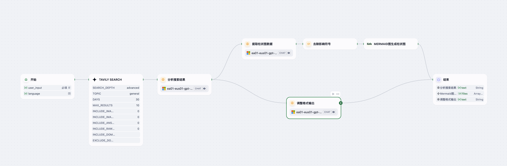
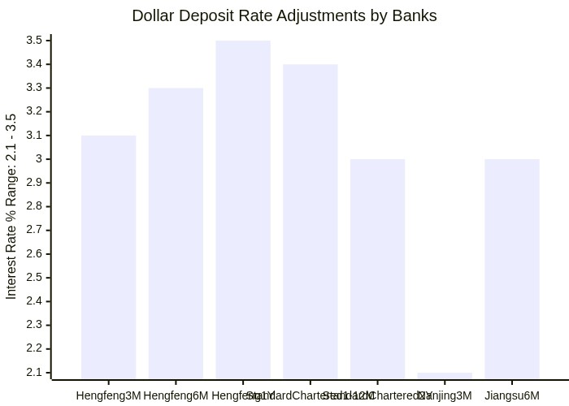

# Financial Topic Analysis Agent

> 一个基于 Dify 平台的智能 Agent，根据用户给定的金融话题自动检索、分析并生成专业评论报告，包含“事件回顾”、“分析师观察”与“数据整理（表格 & 图表）”。  
> An intelligent Dify-based agent that automatically retrieves, analyzes and comments on financial topics provided by the user, producing a professional report with “Event Review,” “Analyst Observations,” and “Data Compilation (tables & charts).”

---

## 详细介绍 Detailed Introduction

### 背景与意义 Background & Purpose  
在金融资讯快速变化的时代，投资者和分析师需要及时、专业地解读各类金融事件。手动检索、整理和撰写深度评论既费时又容易遗漏关键视角。  
**Financial Topic Analysis Agent** 致力于：  
- 自动使用高级搜索（Tavily Search）抓取相关信息；  
- 基于检索结果生成“事件回顾”与“分析师观察”两部分深度评论；  
- 从结果中抽取可视化数据，生成 Markdown 表格与 Mermaid 柱状图；  
- 输出一份结构化、可读性强的 Markdown 报告，支持中英文切换。

In an era of fast-moving financial news, investors and analysts need timely, in-depth commentary. Manual retrieval, synthesis and writing of such reports is time-consuming and error-prone.  
**Financial Topic Analysis Agent** aims to:  
- Leverage advanced Tavily Search to gather relevant data;  
- Generate “Event Review” and “Analyst Observations” sections based on search results;  
- Extract chartable data to produce Markdown tables and Mermaid bar-charts;  
- Deliver a structured, reader-friendly Markdown report in either Chinese or English.

---

## 核心功能 Core Features  

1. **输入支持 Input**  
   - `user_input`：用户描述的金融话题 / Financial topic text (e.g., “多家银行美元存款利率降至‘3字头’”)  
   - `language`（可选）：输出语言 / Output language (`zh` 或 `en`)

2. **工作流 Workflow**  
   1. **Tavily Search**：高级检索近 30 天内相关网页内容（最多 10 条）。  
   2. **分析搜索结果**：LLM 整合并生成“事件回顾”、“分析师观察”文本稿。  
   3. **提取柱状图数据**：从分析结果中挑选可量化的数据点。  
   4. **去除影响符号**：清洗文本，确保 Mermaid 代码格式正确。  
   5. **生成 Mermaid 柱状图**：输出 `xychart-beta` 语法的 Mermaid 代码。  
   6. **调整格式输出**：最终汇总 Markdown 报告、Mermaid 文件和图表描述。

3. **输出格式 Output**  
   - **Markdown 报告**：完整的文字评论，包含“事件回顾”、“分析师观察”及“数据整理”章节。  
   - **Mermaid 柱状图**：`xychart-beta` 格式代码，可直接渲染交互式图表。  
   - **下载文件**：Mermaid 代码文件与原始分析文本。

---

## 工作流示意图 Workflow Diagram

---

## 示例输入 Example Input

user_input: 多家银行美元存款利率降至“3字头”
language: en

## 示例输出 Example Output
### Event Review
#### Background Information:
- Recently, multiple banks in China have adjusted their dollar deposit interest rates downward, with most products now offering annual rates below 3.5%. In some cases, rates have dropped to the "2% range."
- This movement reflects broader changes in the financial landscape influenced by global monetary policies, particularly the Federal Reserve's rate cuts.

#### Developments:
- Effective March 1, 2025, several banks made notable rate adjustments:
  - **Hengfeng Bank**:
    - Reduced its 1-month deposit rate to 3.1% (down by 90 basis points).
    - Adjusted 6-month and 1-year rates to 3.3% and 3.5%, respectively.
  - **Standard Chartered Bank**:
    - Unified its rates for 1-month to 1-year deposits at 3.4%.
    - Lowered its 2-year deposit rate to 3%.
    - Requires a minimum deposit of $40,000 for these rates.
  - **City Commercial Banks** (e.g., Nanjing Bank, Jiangsu Bank, Hangzhou Bank):
    - Nanjing Bank reduced its 3-month rate from 4.3% to 2.1%.
    - Jiangsu Bank's dollar deposit rates dropped to around 3%.
- Even foreign banks like **HSBC**, **DBS Bank**, and **East Asia Bank** have followed suit:
  - East Asia Bank's 1-year deposit rate decreased from 4.4% to 3.5%.

#### Impact Analysis:
- **On Investors**:
  - Lower yields on dollar deposits may push investors to explore alternative vehicles, such as dollar-denominated bonds or overseas products.
  - Some are rushing to lock in higher rates before subsequent cuts.
- **On the Market**:
  - A general decline in deposit rates reflects narrowing arbitrage opportunities.
  - Aligns with the Fed’s easing monetary policy, reducing appeal of dollar-denominated assets.

---

### Analyst Observations
#### Expert Opinions:
- **Yang Haiping** (Shanghai Finance and Law Institute):
  - Attributes the downward adjustment to U.S. benchmark rates, RMB stability, and banks' reduced dollar liquidity demand.
- **Lou Feipeng** (China Post Savings Bank):
  - Cites Fed rate cuts as the primary driver.
  - Predicts further declines if the Fed remains accommodative.

#### In-Depth Analysis:
- The Fed’s rate-cut cycle began in September 2024, totaling 100 bps so far.  
- Chinese banks adjusted deposit rates to manage interest rate mismatches and optimize balance sheets.

#### Future Predictions:
- **Short-Term**:
  - Rates may continue to fall as the Fed is expected to cut another 75 bps this year.
  - Investors should weigh FX risk and liquidity needs.
- **Long-Term**:
  - Shrinking “rate highlands” could alter how banks manage dollar liabilities.
  - A rebound requires a Fed policy shift and renewed dollar liquidity demand.

---

### Data Compilation
#### Key Rate Adjustments by Banks:
| Bank               | Deposit Term | Previous Rate (%) | Current Rate (%) | Change (bps) | Min. Deposit ($) |
|--------------------|--------------|-------------------|------------------|-------------:|-----------------:|
| Hengfeng Bank      | 3 Months     | 4.0               | 3.1              |        −90   | 10,000           |
| Hengfeng Bank      | 6 Months     | 3.8               | 3.3              |        −50   | 10,000           |
| Hengfeng Bank      | 1 Year       | 3.7               | 3.5              |        −20   | 10,000           |
| Standard Chartered | 1–12 Months  | 3.8–4.0           | 3.4              | −40 to −60   | 40,000           |
| Standard Chartered | 2 Years      | 3.5               | 3.0              |        −50   | 40,000           |
| Nanjing Bank       | 3 Months     | 4.3               | 2.1              |       −220   | —                |
| Jiangsu Bank       | 6 Months     | 3.8               | ~3.0             |       ~−80   | —                |

#### Federal Reserve Rate Cuts:
| Date       | Cut (bps) | Cumulative Cut (bps) |
|------------|----------:|---------------------:|
| Sep 2024   |        25 |                   25 |
| Nov 2024   |        50 |                   75 |
| Jan 2025   |        25 |                  100 |
| Expected   |        75 |                  175 |

---

