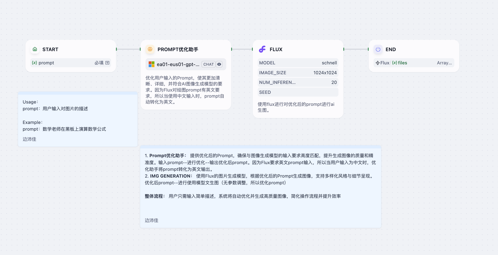

# Image Generator Agent

> 一个基于 Dify 平台的智能 Agent，通过优化用户输入的 prompt 并调用 Flux 图像生成模型快速创作高质量视觉内容。  
> An intelligent Dify-based agent that refines user‐provided prompts and leverages the Flux image generation model to create stunning visuals in no time.

---

## 详细介绍 Detailed Introduction

在 AI 绘图领域，一个清晰、精准且符合模型要求的 prompt 往往能大幅提升生成效果。  
**Image Generator Agent** 致力于：  
1. **Prompt 优化**  
   - 自动分析并提炼用户的自然语言描述  
   - 补充必要细节、消除歧义  
   - 将中文等非英文输入翻译并格式化为英文 prompt  
2. **图像生成**  
   - 使用 Flux 内置的 `schnell` 模型（1024×1024，20 步采样）  
   - 支持多样化风格与细节呈现  
   - 一键输出高分辨率图片文件  

This agent streamlines the process of text-to-image creation by:  
1. **Prompt Refinement**  
   - Extracting and structuring “Subject”, “Action/State”, “Environment/Background” and “Colors & Lighting”  
   - Translating non-English descriptions into concise English prompts  
2. **Image Generation**  
   - Invoking the Flux `schnell` model (1024×1024, 20 inference steps)  
   - Delivering rich, detailed images ready for use

---

## 核心功能 Core Features

- **多语言支持 & 自动翻译**  
  中文或其他语言输入时，自动生成符合 Flux 需求的英文 prompt  
- **结构化 Prompt**  
  Clear four‐section format:  
  1. Subject  
  2. Action/State  
  3. Environment/Background  
  4. Colors & Lighting  
- **高质量图像**  
  使用 Flux `schnell` 模型，支持 1024×1024 输出与 20 步采样  
- **一键工作流**  
  用户仅需输入一句描述，自动完成优化与生成，极大提升效率

---

## 工作流示意图 Workflow Diagram

---

## 示例输入 Example Input

主体：父亲和儿子  
背景：温馨的家庭时光  
色彩：轻松愉快  
动作：共同合作解谜游戏，增进感情与默契

## 示例输出 Example Output

