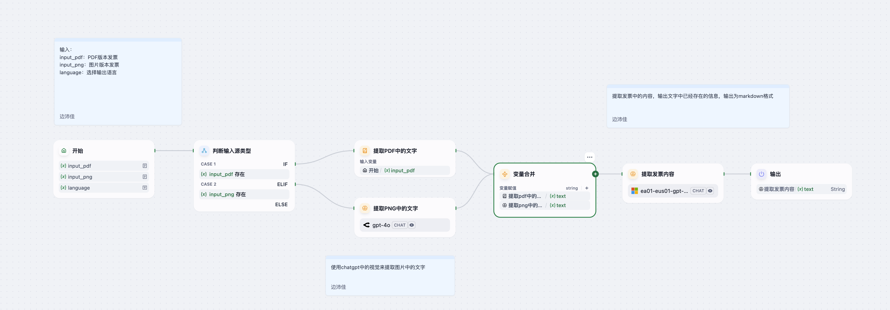

# Invoice Information Extraction Agent

> 一个基于 Dify 平台的智能 Agent，自动识别并提取 PDF 或图片格式发票中的关键信息，以 Markdown 格式输出。  
> An intelligent Dify-based agent that automatically reads PDF or image invoices and extracts key fields, outputting them in Markdown.

---

## 详细介绍 Detailed Introduction

### 背景与意义 Background & Purpose  
在企业财务与报销流程中，手动录入发票信息既耗时又容易出错。  
**Invoice Information Extraction Agent** 致力于：  
- 自动识别 PDF 发票或扫描图片中的文字（OCR）；  
- 从原始票据中提取已有字段，如发票代码、号码、日期、买卖双方信息、货物明细、金额与税额等；  
- 支持中英文输出（由 `language` 参数控制）；  
- 以清晰的 Markdown 格式呈现，可直接粘贴到系统或文档中。

In corporate finance and expense workflows, manually keying in invoice data is time-consuming and error-prone.  
**Invoice Information Extraction Agent** aims to:  
- Perform OCR on PDF or image invoices;  
- Extract existing fields—invoice code, number, date, buyer & seller info, line-item details, amounts, taxes, totals;  
- Support output in Chinese or English (controlled by the `language` parameter);  
- Present results in clean Markdown for easy integration.

---

## 核心功能 Core Features

1. **多源输入 Multi-Source Input**  
   - `input_pdf`：PDF 格式发票文件  
   - `input_png`：扫描或照片格式发票图像  
   - `language`（可选）：输出语言，如 `zh` 或 `en`  

2. **智能提取 Intelligent Extraction**  
   - OCR 识别（文本层 & 图像层双路）  
   - 关键字段定位：发票代码、发票号码、开票日期、校验码  
   - 买方/卖方信息：名称、纳税人识别号、地址电话、开户行及账号  
   - 明细行项目：名称、规格型号、单位、数量、单价、金额、税率、税额  
   - 汇总字段：价税合计（大写/小写）、备注、开票人、复核、收款人  

3. **Markdown 输出 Markdown-Formatted Output**  
   - 仅输出输入中实际存在的字段  
   - 字段名与内容自动翻译（若指定 `language`）  
   - 便于粘贴到系统、报告或审批流程

---

## 工作流示意图 Workflow Diagram

---

## 示例输入 Example Input

input_pdf:[example PDF](input_example.pdf)  
input_png: –              # 若只有 PDF，可留空
language: en              # 输出为英文；若省略则保持原文

## 示例输出 Example Output

**Invoice Date**: March 6, 2025  
**Invoice Type**: Electronic Invoice (General Invoice)  
**Invoice Number**: 25117000000266034039  

**Buyer Name**: Li Zheyang  
**Buyer Taxpayer Identification Number**: –  
**Buyer Address & Phone**: –  
**Buyer Bank & Account**: –  

**Seller Name**: Beijing Xiangxian Technology Co., Ltd.  
**Seller Taxpayer Identification Number**: 91110105MA0052U868  
**Seller Address & Phone**: –  
**Seller Bank & Account**: –  

**Goods or Taxable Services**:  
- **Name**: Soft Drink – Coca-Cola Mini Pack  
  - **Specification**: 300ml×12  
  - **Unit**: Carton  
  - **Quantity**: 1  
  - **Unit Price**: ¥17.61  
  - **Amount**: ¥17.61  
  - **Tax Rate**: 13%  
  - **Tax Amount**: ¥2.29  

- **Name**: Soft Drink – Coca-Cola Mini Pack (Discount)  
  - **Amount**: ¥–3.81  
  - **Tax Rate**: 13%  
  - **Tax Amount**: ¥–0.49  

- **Name**: Fruits – Chilean Imported Cherry Plum 250g  
  - **Specification**: 250g (Single fruit ≥ 20g)  
  - **Unit**: Portion  
  - **Quantity**: 1  
  - **Unit Price**: ¥15.50  
  - **Amount**: ¥15.50  
  - **Tax Rate**: 9%  
  - **Tax Amount**: ¥1.40  

- **Name**: Fruits – Chilean Imported Cherry Plum 250g (Discount)  
  - **Amount**: ¥–0.92  
  - **Tax Rate**: 9%  
  - **Tax Amount**: ¥–0.08  

- **Name**: Soft Drink – Lipovitan D Health Drink  
  - **Specification**: 100ml×2 bottles  
  - **Unit**: Set  
  - **Quantity**: 1  
  - **Unit Price**: ¥14.07  
  - **Amount**: ¥14.07  
  - **Tax Rate**: 13%  
  - **Tax Amount**: ¥1.83  

- **Name**: Fruits – Imported Sable Black Grape 300g  
  - **Specification**: 300g  
  - **Unit**: Box  
  - **Quantity**: 1  
  - **Unit Price**: ¥17.34  
  - **Amount**: ¥17.34  
  - **Tax Rate**: 9%  
  - **Tax Amount**: ¥1.56  

- **Name**: Fruits – Imported Sable Black Grape 300g (Discount)  
  - **Amount**: ¥–0.92  
  - **Tax Rate**: 9%  
  - **Tax Amount**: ¥–0.08  

- **Name**: Soft Drink – Little Elephant Grapefruit Tea Juice Drink  
  - **Specification**: 1 L  
  - **Unit**: Bottle  
  - **Quantity**: 1  
  - **Unit Price**: ¥8.76  
  - **Amount**: ¥8.76  
  - **Tax Rate**: 13%  
  - **Tax Amount**: ¥1.14  

**Subtotal**:  
- **Amount (Excl. Tax)**: ¥81.43  
- **Tax Amount**: ¥9.37  

**Total (Incl. Tax)**:  
- **In Words**: Ninety Yuan and Eight Cents  
- **In Numbers**: ¥90.80  

**Issuer**: Nie Lingxuan  
