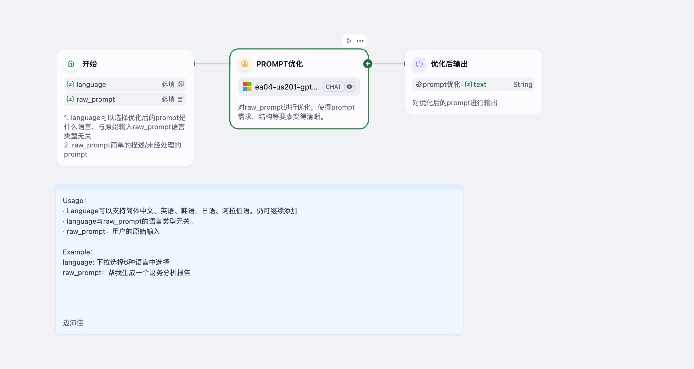

# Meta Prompt Agent

> 一个基于 Dify 平台的智能 Agent，帮助用户根据任务描述自动生成或优化高质量多语言提示词。  
> An intelligent Dify-based agent that automatically creates or refines high-quality, multilingual prompts based on your task description.

---

## 详细介绍 Detailed Introduction

### 背景与意义 Background & Purpose  
在与大模型交互时，一个清晰、结构化且贴合目标语言的提示词往往能显著提升模型输出质量。但手动撰写与优化提示词需要大量经验与反复试错。  
**Meta Prompt Agent** 的目标是：  
- 根据用户提供的初始描述（raw_prompt）自动生成规范化提示词；  
- 支持中文、英文、韩语、日语、阿拉伯语等多种输出语言；  
- 清晰地列出任务目标、步骤、输出格式与示例，帮助用户快速获得高效提示。

When interacting with large LLMs, a clear, structured, and target-language-appropriate prompt can greatly improve output quality. Manually crafting and refining prompts, however, requires expertise and trial-and-error.  
**Meta Prompt Agent** aims to:  
- Generate a standardized, high-quality prompt from your raw task description;  
- Support multiple output languages (Simplified/Traditional Chinese, English, Korean, Japanese, Arabic, etc.);  
- Provide a clear template of task objectives, steps, output format, and examples to streamline prompt-engineering.

---

## 核心功能 Core Features  

1. **多语言支持 Multilingual Output**  
   - 按需选择输出语言：简体中文、繁體中文、English、한국어、日本語、العربية 等。  
   - 与 raw_prompt 的原始语言类型无关，自由切换。  

2. **智能优化 Prompt Refinement**  
   - 分析用户的 raw_prompt，提炼核心目标与需求。  
   - 输出包含“任务目标”、“任务步骤”、“输出格式”、“示例”等要素的完整提示词。  

3. **结构化模板 Structured Template**  
   - 任务描述（Task Description）  
   - 目标（Goals）  
   - 步骤（Steps）  
   - 输出格式（Output Format）  
   - 示例（Examples）  

4. **无缝集成 Workflow Integration**  
   - Dify 平台工作流调用：输入变量→LLM 优化→输出优化后的 prompt。  
   - 可作为其它 Agent 的上游组件，用于动态 prompt-engineering。

---

## 工作流示意图 Workflow Diagram

---

## 示例输入 Example Input

language: english
raw_prompt: 针对给定的金融话题，以及给定的搜索结果，生成分析评论。分为“事件回顾”“分析师观察”两个部分。并将搜索结果中可以形成表格的内容，使用表格进行展示出来。如果搜索结果中包含多个数字可以形成图表，则整理数字并输出。输出使用markdown格式

## 示例输出 Example Output

### Task Description
You are tasked to analyze a given financial topic using the provided search results. The analysis should be structured into two parts: **Event Recap** and **Analyst Observations**. If the search results contain data that can be organized into tables or graphs, format the output accordingly using Markdown.

### Goals
1. Summarize the key events related to the financial topic in the **Event Recap** section.
2. Provide detailed observations and analysis in the **Analyst Observations** section.
3. Present numerical or tabular data in a structured format using Markdown tables or graphs.

### Steps
1. **Event Recap**:
   - Extract key events from the search results.
   - Summarize the timeline or background of the topic.
   
2. **Analyst Observations**:
   - Analyze the implications of the events.
   - Provide expert insights, predictions, or discussions about trends.
   
3. **Data Formatting**:
   - Identify datasets or numerical information in the search results.
   - Use Markdown tables for tabular data.
   - Create lists or graphs for numerical trends.

### Output Format
The output should follow this Markdown structure:

markdown
## Event Recap
- **Summary**: Provide a brief overview of the financial topic.
- **Key Events**:
  - Event 1: [Description]
  - Event 2: [Description]
  - Event 3: [Description]

## Analyst Observations
- **Insights**:
  - Observation 1: [Detailed analysis]
  - Observation 2: [Detailed analysis]
- **Predictions**:
  - Forecast 1: [Prediction]
  - Forecast 2: [Prediction]

## Data Table
| Column 1 | Column 2 | Column 3 | Column 4 |
|----------|----------|----------|----------|
| Data 1   | Data 2   | Data 3   | Data 4   |
| Data 5   | Data 6   | Data 7   | Data 8   |

## Graph Representation
If applicable, numerical data can be grouped into a graph format.

### Example Input and Output

#### Input:
Financial topic: "The impact of interest rate hikes on stock markets"
Search Results:
1. "The Federal Reserve raised interest rates by 0.75% in September 2023."
2. "The S&P 500 fell by 3.2% following the announcement."
3. "Historical data shows stock markets tend to decline by an average of 5% after rate hikes."
4. "Inflation forecasts for Q4 2023 remain at 6.1%, despite monetary tightening."

#### Output:

markdown
## Event Recap
- **Summary**: The Federal Reserve's recent interest rate hike has caused significant shifts in stock market performance.
- **Key Events**:
  - **Interest Rate Hike**: On September 2023, the Fed raised interest rates by 0.75%.
  - **Market Reaction**: The S&P 500 fell by 3.2% following the announcement.
  - **Historical Trends**: Stock markets have historically declined by an average of 5% after rate hikes.

## Analyst Observations
- **Insights**:
  - The aggressive monetary policy reflects the Fed's commitment to curbing inflation, currently forecasted at 6.1% for Q4 2023.
  - Short-term market volatility is expected, with sectors like tech and real estate most vulnerable to interest rate sensitivity.
- **Predictions**:
  - Further rate hikes may lead to continued stock market declines, particularly in growth-heavy indices like the NASDAQ.
  - Inflation rates may stabilize by mid-2024, potentially creating a more favorable market environment for recovery.

## Data Table
| Event                 | Impact            | Percentage Change | Forecasted Inflation |
|-----------------------|-------------------|-------------------|----------------------|
| Interest Rate Hike    | S&P 500 Decline  | -3.2%             | 6.1%                |
| Historical Average    | Market Drop      | -5%               | N/A                 |

## Graph Representation
### Stock Market Performance After Rate Hikes
- **Historical Decline**: -5%
- **Recent Decline (S&P 500)**: -3.2%
- **Inflation Forecast**: 6.1%

This structure ensures the financial commentary is both insightful and visually organized for easy comprehension.