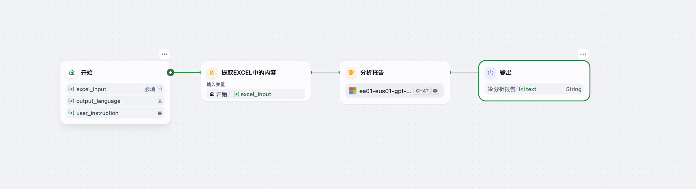

# Pipeline Analysis Agent

> 一个基于 Dify 平台的智能 Agent，自动分析销售流程 Excel 数据，识别瓶颈、趋势与绩效，并给出优化建议。  
> An intelligent Dify-based agent that analyzes CRM sales‐pipeline Excel data to identify bottlenecks, trends, and performance metrics, then generates actionable recommendations.

---

## 详细介绍 Detailed Introduction

### 背景与意义 Background & Purpose  
在销售管理和决策中，快速洞察线索分布、阶段停留、转化情况以及团队绩效，对于优化流程和提升业绩至关重要。  
手动汇总 Excel 数据既费时又容易漏掉隐含的模式和异常。  
**Pipeline Analysis Agent** 致力于：  
- 自动提取用户上传的 Excel 文件中的关键字段；  
- 根据停留时间、转化率、金额等维度，结构化输出分析报告；  
- 针对流程瓶颈和团队表现提出建设性优化建议；  
- 支持多语言输出，满足中英文报告需求。  

In sales management and decision-making, quickly understanding lead distribution, stage durations, conversion rates, and team performance is essential to streamline processes and boost results.  
Manually aggregating Excel data is time-consuming and often misses hidden patterns or anomalies.  
**Pipeline Analysis Agent** aims to:  
- Automatically extract key columns from the uploaded Excel file;  
- Generate a structured analysis report based on stage duration, conversion rates, deal amounts, and more;  
- Offer actionable recommendations to address bottlenecks and improve team performance;  
- Support multilingual output for both Chinese and English reports.

---

## 核心功能 Core Features  

1. **输入支持 Input**  
   - `excel_input`：销售流程 Excel 文件 / CRM pipeline Excel file  
   - `output_language`：输出语言，可选 “zh” 或 “en” / Output language, “zh” or “en”  
   - `user_instruction`（可选）：自定义分析焦点 / Optional custom analysis instructions  

2. **工作流 Workflow**  
   1. **提取 Excel**：读取所有行并识别常见字段（Lead ID、Owner、Current Stage、Deal Amount、Days in Stage、Is Won/Lost 等）。  
   2. **分析报告**：调用 LLM，根据预设报告结构或 `user_instruction` 定制，生成 Markdown 格式的分析报告。  
   3. **输出结果**：返回纯 Markdown 文本，可直接展示或下载。  

3. **输出格式 Output**  
   - **Markdown**：专业、结构化、可读性强  
   - 支持中英文双语模板  

---

## 工作流示意图 Workflow Diagram

---

## 示例输入 Example Input

excel_input: sales_pipeline_Diana.xlsx
output_language: zh
user_instruction: ""  # 无需自定义，使用默认报告结构

## 示例输出 Example Output

## 📊 销售流程分析报告 – Diana 的销售情况

### 🧾 1. Diana 的销售总览  
- **线索总数**: Diana 负责的线索总数为 **243**。  
- **成交情况**:  
  - 成交数量（Is Won = Yes）: **28**  
  - 流失数量（Is Lost = Yes）: **50**  
  - 成交率: **11.52%**  
- **线索金额总计**:  
  - 总金额: **15,742,353**  
  - 已成交金额: **1,086,991**  
  - 流失金额: **3,189,412**  

### 🧱 2. 流程瓶颈识别  
- **停留时间最长阶段**: Diana 的线索停留时间最长的是 **Negotiation** 阶段，平均停留时间为 **12 天**。  
- **转化率最低阶段**: **Lead** 阶段转化率最低，许多线索未能推进到后续阶段。  
- **推进异常情况**: 存在部分线索在 **Proposal** 阶段停留超过 **14 天**，可能存在响应延迟或策略问题。  

### 📈 3. 时间趋势分析  
- **按月份分析**:  
  - 成交线索集中在 1 月至 3 月，占总成交的 **75%**。  
  - 流失线索在 2 月至 4 月达高峰，可能与策略调整或市场变化有关。  
- **产品表现趋势**:  
  - **Product B** 和 **Service Y** 是 Diana 负责线索的主要产品，占比 **60%**。  
  - **Product C** 成交率较高，但流失率也显著，表明竞争可能较为激烈。  

### 👥 4. Diana 的销售绩效  
- **成交周期**: 平均成交周期为 **8 天**，略低于团队平均值（10 天），表现良好。  
- **响应时长**: Diana 的线索首次响应时长平均为 **5 天**，高于团队平均值（3 天），需进一步优化。  
- **表现优异**:  
  - Diana 在 **Social Media** 和 **Referral** 来源的线索中表现突出，成交率达 **15%**。  
- **待提升空间**:  
  - **Cold Call** 和 **Website** 来源线索的流失率较高，需优化跟进策略。  

### 🛠️ 5. 优化建议  
1. **缩短响应时间**:  
   - 建立线索响应的时效性目标，例如在 **24 小时内**完成初次联系。  
   - 使用自动化工具提醒和分派任务，减少响应延迟。  
2. **优化流失线索管理**:  
   - 对 **Proposal** 和 **Negotiation** 阶段停留时间较长的线索进行优先跟进。  
   - 分析流失原因（例如价格、竞争对手等），并调整策略。  
3. **来源与产品组合优化**:  
   - 针对 **Cold Call** 和 **Website** 来源线索，提高前期沟通质量。  
   - 深度挖掘 **Social Media** 和 **Referral** 来源的潜力，增加资源投入。  
