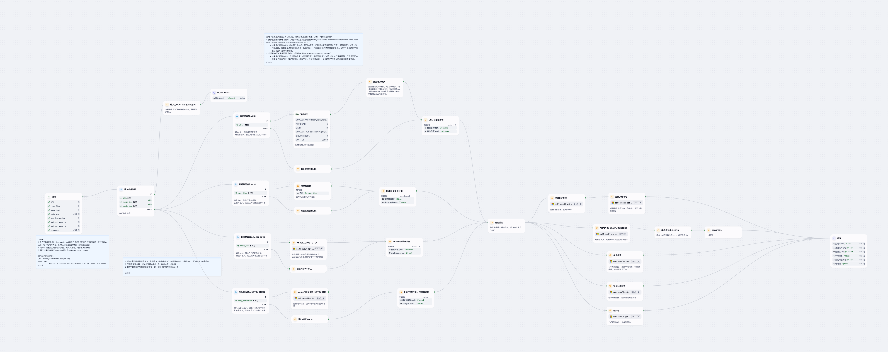
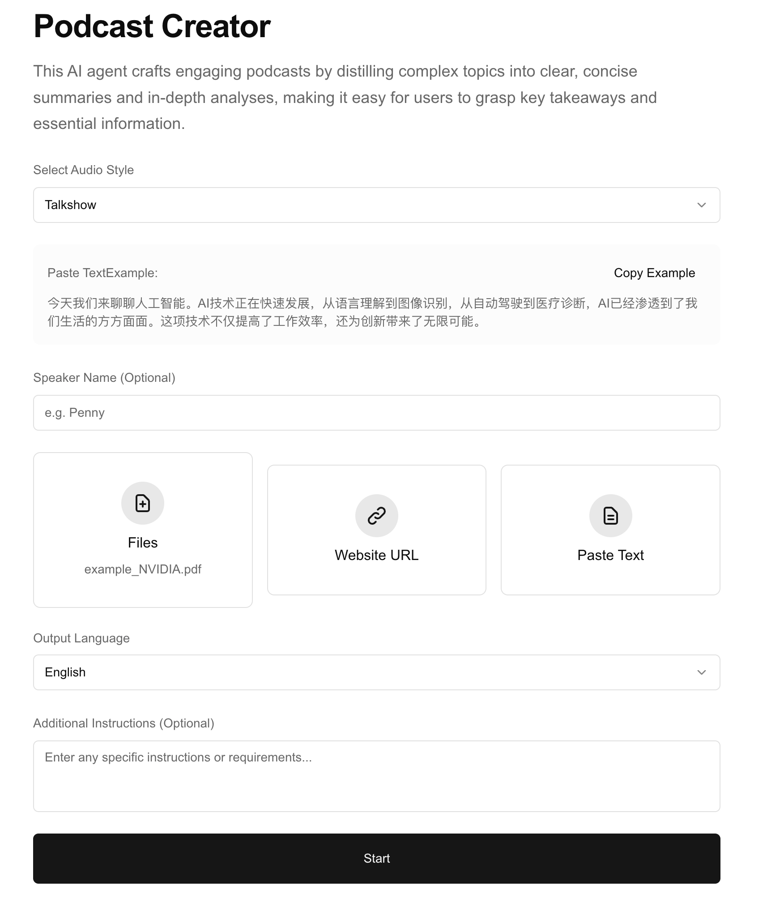
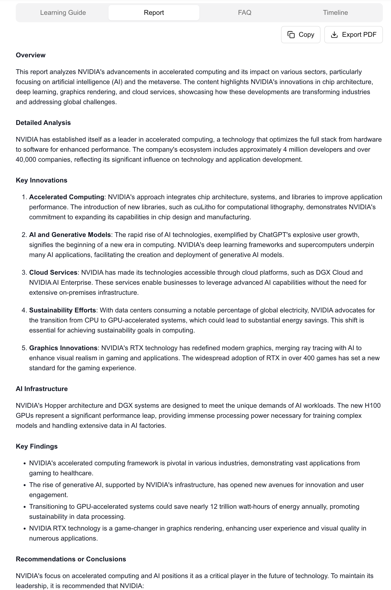
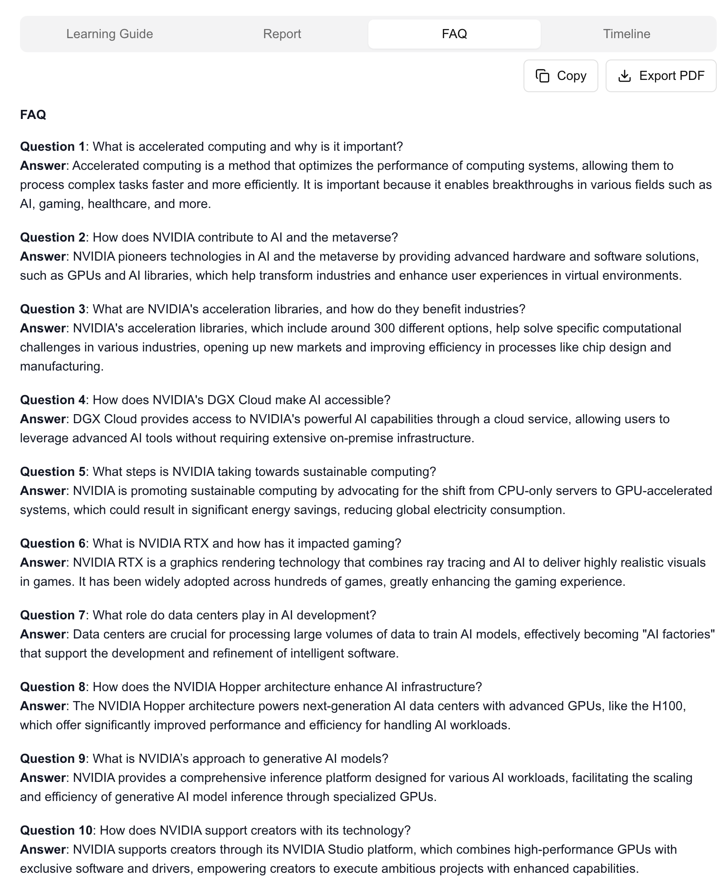
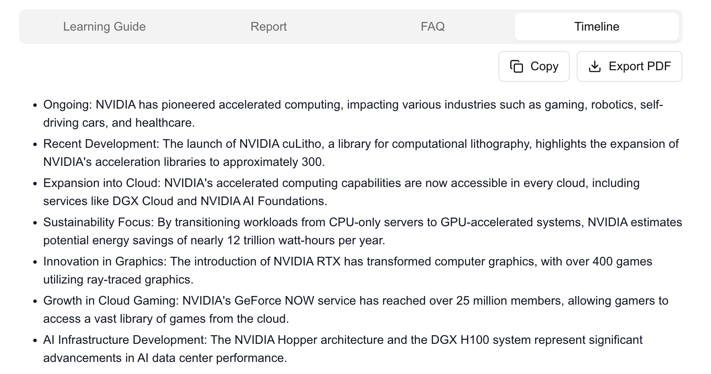

# Podcast Creator Agent

> 一个基于 Dify 平台的智能 Agent，将复杂主题蒸馏为清晰、简洁的播客脚本，包括要点总结、深度分析与多种角色对话。  
> An intelligent Dify-based agent that crafts engaging podcast scripts by distilling complex topics into clear, concise summaries, in-depth analysis, and role-based dialogue.

---

## 详细介绍 Detailed Introduction

### 背景与意义 Background & Purpose  
在信息泛滥的时代，将冗长或格式混乱的内容手动改编成连贯、有趣的播客脚本既费时又考验创意。  
**Podcast Creator Agent** 致力于：  
- 自动解析用户上传的文档、网页或粘贴文本；  
- 根据“Talkshow”或“Crosstalk”音频风格和指定主持人/嘉宾生成脚本；  
- 支持中英文脚本输出，适配不同听众；  
- 输出符合语音合成（TTS）格式的 JSON，直接用于音频制作。

In the age of information overload, manually converting lengthy or messy content into a coherent, engaging podcast script is time-consuming and creativity-intensive.  
**Podcast Creator Agent** aims to:  
- Automatically ingest files, URLs, or pasted text;  
- Generate scripts in “Talkshow” or “Crosstalk” style with designated host and guest personas;  
- Produce final script in Chinese or English as specified;  
- Output TTS-ready JSON so you can plug directly into audio production pipelines.

---

## 核心功能 Core Features  

1. **多源输入 Multi-Source Input**  
   - 上传文件：PDF、图片、视频等  
   - 远程链接：URL 爬取网页内容  
   - 粘贴文本：自由文本输入  

2. **对话风格 Dialogue Styles**  
   - **Talkshow**：单人主持，用男声／女声播报  
   - **Crosstalk**：主持人与嘉宾对话，支持角色名与语音配置  

3. **脚本生成 Script Generation**  
   - 分析语言：中英文自动识别并输出对应脚本  
   - 内容提炼：提取关键要点、梳理逻辑顺序  
   - 创意润色：加入类比、故事化开场、思考问题等提升听觉体验  

4. **TTS 输出 TTS-Ready Output**  
   - 生成符合 JSON 规范的文本和声音字段  
   - 可直接输入 Azure/Google/AWS 等语音合成接口  

---

## 工作流示意图 Workflow Diagram

---

## 前端示例 Frontend Preview

---

## 示例输入 Example Input

Paste Text: 今天我们来聊聊人工智能的发展，从图像识别到自动驾驶，AI 已渗透到生活各个层面，带来效率与创新。
Host name: Penny
Guest name: Leo
Language of output: English
Additional Instructions: Keep it under 800 words, conversational tone.

## 示例输出 Example Outputs

### Learning Guide

### Report

### FAQ

### Timeline

