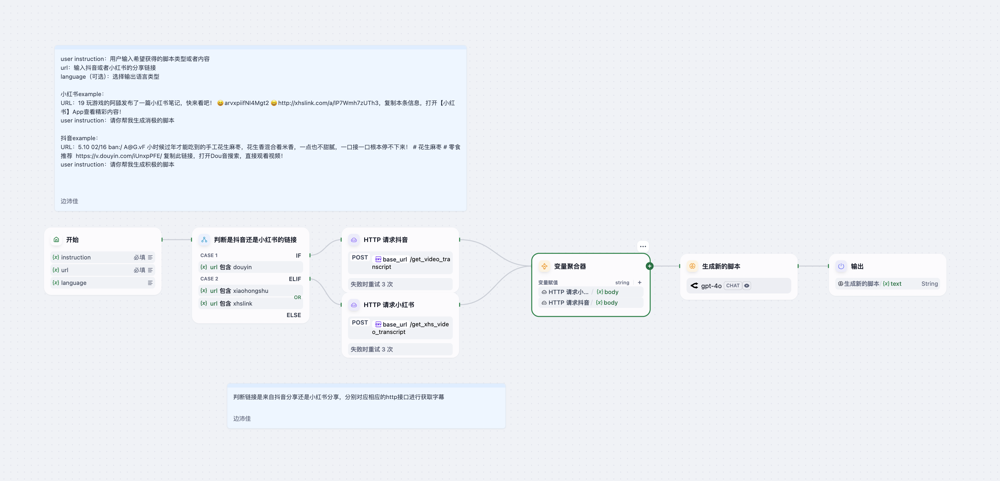

# Short Video Creator Agent  
短视频脚本生成 Agent

> 【By Brianna】上传一个短视频或分享链接，输入创作指令，生成新的二创脚本。  
> Upload a short video file or URL, provide an instruction, and generate a fresh derivative script.

---

## 简介 Introduction

**中文：**  
Short Video Creator Agent 是基于 Dify 平台的智能工作流，能够自动识别抖音或小红书视频链接，抓取原始字幕并根据用户指令进行二次创作，输出完整的短视频脚本。  
**English:**  
The Short Video Creator Agent is a Dify-based workflow that detects Douyin or Xiaohongshu links, fetches original video transcripts, and—guided by your instruction—rewrites them into a brand-new short-video script.

---

## 核心功能 Key Features

| 功能 Feature                                | 描述 Description                                                                                                         |
|--------------------------------------------|--------------------------------------------------------------------------------------------------------------------------|
| **平台适配** Platform Adaptation            | 自动判断 URL 来源：Douyin（抖音）或 Xiaohongshu（小红书）并调用对应接口抓取字幕 :contentReference[oaicite:0]{index=0}。                  |
| **多模式输入** Multi-mode Input             | 支持视频文件本地上传或远程 URL，灵活适配多种使用场景。                                                                     |
| **LLM 二次创作** LLM-driven Rewrite         | 通过 GPT-4o 对原字幕进行创意重组与润色，生成“场景描述 + 对话 + 旁白”格式完整脚本。                                          |
| **可选输出语言** Language Selection        | 可选 `language` 参数决定最终脚本输出语言，未指定则沿用原视频语言。                                                         |
| **工作流自动化** Workflow Automation        | 集成 HTTP 请求、变量聚合与 LLM 节点，流程一键触发，免去手动处理繁琐步骤。                                                   |
| **参数可配置** Configurable Environment     | `base_url` 环境变量可自定义字幕抓取服务端点，支持内部部署或多环境切换。                                                    |

---

## 工作流示意图 Workflow Diagram

  
流程：Start → 判断链接来源 → HTTP 请求抖音／小红书字幕 → 变量聚合 → GPT-4o 生成新脚本 → End

---

## 输入参数 Inputs

| 参数 Parameter       | 类型 Type    | 必填 Required | 描述 Description                                    |
|----------------------|--------------|---------------|------------------------------------------------------|
| `instruction`        | `string`     | 是 Yes        | 用户对脚本的创作指令（例如“生成积极风格脚本”）。      |
| `url`                | `string`     | 是 Yes        | 视频分享链接，支持抖音或小红书 URL。                  |
| `language`           | `string`     | 否 No         | 可选：指定脚本输出语言（如`zh`、`en`等）。若不指定，则沿用原视频语言。 |

---

## 输出结果 Output

| 参数 Parameter      | 类型 Type    | 描述 Description                               |
|---------------------|--------------|-------------------------------------------------|
| `text`              | `string`     | 生成的二次创作短视频脚本文本。                  |

---

## 使用示例 Example

**请求示例 Request:**  
```json
{
  "instruction": "帮我生成一个轻松幽默的脚本",
  "url": "https://v.douyin.com/iUnxpPFE/",
  "language": "zh"
}
````

**响应示例 Response:**

```markdown
### 场景：阳光明媚的午后，宁静的小院中，桌上摆满了各色小吃。

**旁白**（轻松愉悦）：今天，我们要品尝一款来自福建的手工花生麻枣！

**角色A**（兴奋地）：这可是小时候过年才能吃到的美味，一口下去，花生香混合米香，根本停不下来！

**角色B**（好奇地）：真的吗？那我得赶紧试试！

…（后续完整脚本）
```

---

## 快速开始 Quick Start

1. **导入 Agent**

   * 登录 Dify 控制台 → “创建应用” → 上传 `Short Video Creator Agent.yml` 。
2. **配置环境变量**

   * 在控制台设置 `base_url` 为字幕服务地址（默认 `https://iagent.cc/video-analysis-api`）。
3. **运行测试**

   * 填写 `instruction`、`url`（及可选 `language`），点击 Start → 获取生成脚本。

---
