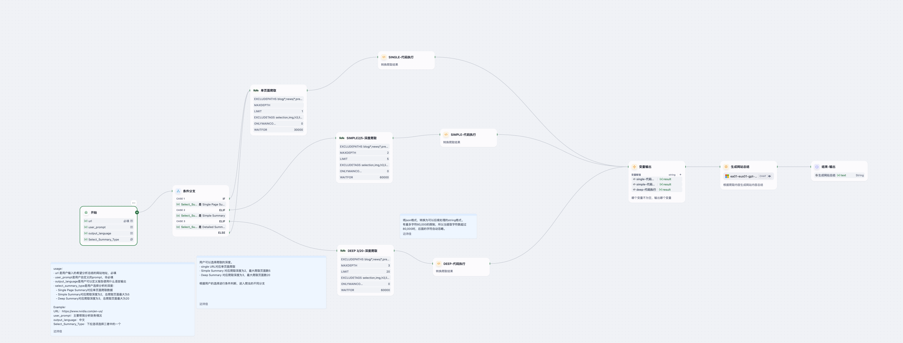

# Website Summary Agent

> 一个基于 Dify 平台的智能 Agent，自动抓取并总结给定网站的核心内容，输出结构化 Markdown 报告。  
> An intelligent Dify-based agent that crawls and summarizes the key information from any website URL, producing a structured Markdown report.

---

## 详细介绍 Detailed Introduction

### 背景与意义 Background & Purpose  
当你需要快速了解某家公司、产品或组织的官方网站内容时，手动浏览多个页面、筛选关键信息既耗时又繁琐。  
**Website Summary Agent** 致力于：  
- 自动根据用户提供的 URL 爬取网页内容（支持单页或多页深度）；  
- 分析并提炼“公司概览”、“产品与服务”、“解决方案”、“差异化优势”、“全部产品”及“公司背景”等章节；  
- 支持自定义语言与提示词，输出清晰易读的 Markdown 文档。

In order to quickly grasp the essentials of a company, product or organization’s website, manual browsing and note-taking can be time-consuming and error-prone.  
**Website Summary Agent** aims to:  
- Crawl the provided URL (single page, shallow or deep) to collect site content;  
- Analyze and distill it into sections like **Company Overview**, **Products & Services**, **Solutions & Services**, **Key Differentiators**, **Full Offerings**, **Company Background**, and **Blog Summary**;  
- Support custom user prompts and output languages, yielding a clean, structured Markdown report.

---

## 核心功能 Core Features  

1. **多模式爬取 Multi-Mode Crawling**  
   - **Single Page Summary**：仅抓取首页内容，快速生成单页摘要  
   - **Simple Summary**：浅层爬取（深度=2，最多5页），适合概览多页网站  
   - **Deep Summary**：深度爬取（深度=3，最多20页），全面覆盖主要栏目  

2. **智能分析 & 摘要**  
   - 提取并归纳页面文字与结构  
   - 自动分节生成：公司概览、产品、解决方案、差异化优势、全部产品、公司背景、博客摘要  

3. **自定义提示 & 语言 Custom Prompt & Language**  
   - `user_prompt`（可选）：为分析添加重点指引  
   - `output_language`（可选）：支持中文、英文及其他语言  

4. **Markdown 报告 Markdown Report**  
   - 格式化标题与子标题  
   - 清晰分区，便于二次编辑和发布  

---

## 工作流示意图 Workflow Diagram

---

## 示例输入 Example Input

url: https://www.nvidia.com/en-us/
user_prompt: 
output_language: english
Select_Summary_Type: Single Page Summary

## 示例输出 Example Output

### Company Overview
NVIDIA Corporation is a leading American technology company founded in 1993 by Jensen Huang, Chris Malachowsky, and Curtis Priem. Initially focused on the gaming market, NVIDIA has evolved to become a dominant player in graphics processing units (GPUs), artificial intelligence (AI), and deep learning technologies. Key milestones include the release of the first GPU, the GeForce 256, in 1999, which revolutionized the graphics market. Over the years, NVIDIA has expanded its product offerings across various fields including gaming, professional visualization, data centers, and automotive technology, marking significant achievements such as the development of the CUDA platform and the introduction of the GeForce RTX series with real-time ray tracing capabilities.

### Products
NVIDIA offers a broad range of products that cater to different markets:

1. **NVIDIA SHIELD TV**: 
   - **Description**: A streaming media player with 4K HDR entertainment capabilities, built-in Google Assistant, and AI-enhanced upscaling.
   - **Features**: Supports Dolby Vision and Dolby Atmos, over 5000 apps available, and motion-activated remote with backlit buttons.
   - **Pricing**: $149.99 (SHIELD TV) and $199.99 (SHIELD Pro).
   - **Availability**: Available at major retailers and NVIDIA's official website.

2. **Graphics Cards and GPUs**:
   - **Description**: High-performance GPUs designed for gaming and professional applications, including the GeForce and Quadro series.
   - **Features**: Real-time ray tracing, AI-enhancements, and VR support.
   - **Pricing**: Varies by model and specifications.

3. **Data Center Solutions**:
   - **Description**: Includes NVIDIA DGX systems and NVIDIA A100 Tensor Core GPUs for high-performance computing.
   - **Features**: Accelerated computing for AI workloads and data analytics.

4. **Cloud Services**:
   - **Description**: Services designed for AI, machine learning, and deep learning applications.
   - **Features**: Access to NVIDIA GPUs in the cloud for scalable computing.

5. **Embedded Systems**:
   - **Description**: Solutions for robotics, IoT, and autonomous machines.
   - **Features**: AI computing capabilities in edge devices.

### Solutions and Services
NVIDIA provides various solutions tailored to specific industries:

- **Artificial Intelligence**: Solutions for deep learning and machine learning applications, providing tools and frameworks to enhance AI research and deployment.
- **Cloud and Data Center**: Infrastructure and software solutions that enable businesses to utilize powerful GPU computing for data-intensive tasks.
- **Design and Simulation**: Tools for architects and engineers to create simulations and designs with high fidelity.
- **High-Performance Computing**: Solutions aimed at research institutions and enterprises requiring massive computational power.
- **Robotics and Edge AI**: Technologies designed to enhance robotic capabilities and AI processing at the edge.
- **Autonomous Vehicles**: Platforms and solutions that enable the development of self-driving technology.

### Key Differentiators
NVIDIA’s competitive advantages include:

- **Innovative Technology**: Pioneering advancements in GPU technology, including real-time ray tracing and AI-driven graphics.
- **Diverse Product Portfolio**: A wide array of products catering to gaming, professional visualization, data centers, and embedded systems.
- **Strong Ecosystem**: Partnerships with major cloud service providers and extensive developer support through SDKs and frameworks.

### Full Offerings
Current offerings include:

- **NVIDIA SHIELD TV**: High-performance streaming with features like AI upscaling and voice control.
- **GeForce Gaming Hardware**: Comprehensive gaming solutions including GPUs, laptops, and gaming PCs.
- **Data Center Products**: Advanced servers and GPUs for cloud computing and AI.
- **Software Solutions**: Platforms like NVIDIA Omniverse for collaborative 3D content creation and simulation.

### Company Background
NVIDIA is driven by a culture of innovation and excellence. Its core values include a commitment to pushing the boundaries of technology, fostering a diverse and inclusive workplace, and prioritizing sustainability in operations. The company maintains a strong focus on research and development, which has been instrumental in its growth and success.

### Blog Summary
Recent blog posts on NVIDIA’s website cover various topics, including advancements in AI technology, insights into the gaming industry, and updates on new product releases. Key themes often include tutorials for developers, case studies highlighting successful implementations of NVIDIA technology, and discussions on the future of computing and graphics technologies. These blogs serve to engage the community and inform users about the latest developments and innovations from NVIDIA.
