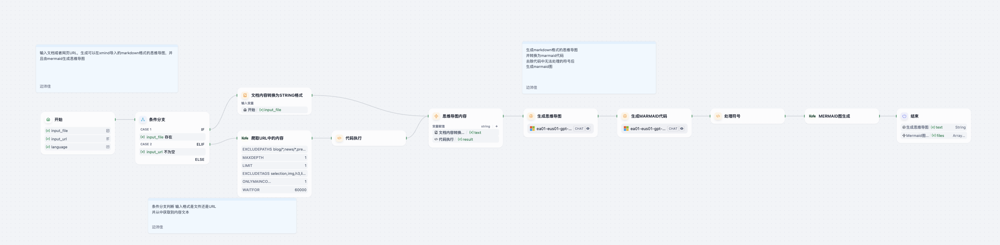
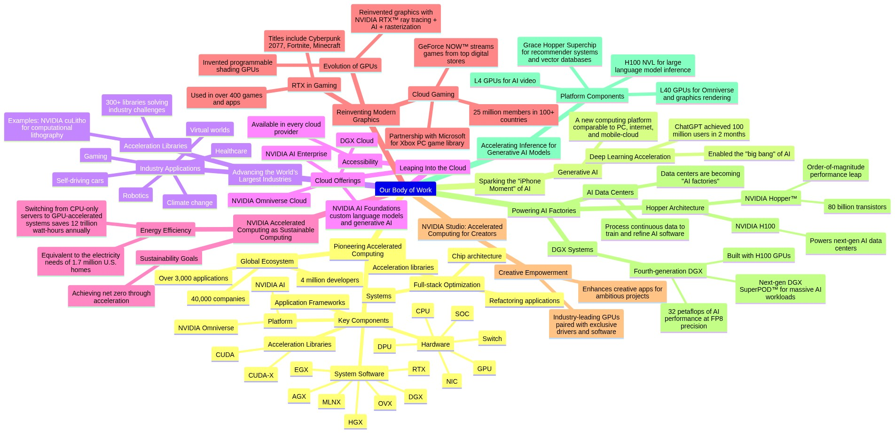

# Content Mind Mapper Agent

> 一个基于 Dify 平台的智能 Agent，将文档、网页或视频内容自动转换为可编辑的思维导图，并生成 XMind 文件或 Markdown + Mermaid 代码输出。  
> An intelligent agent built on the Dify platform that automatically converts documents, web pages, or video content into editable mind maps, exporting both XMind files and Markdown + Mermaid code.

---

## 详细介绍 Detailed Introduction

### 背景与意义 Background & Purpose  
在科研和日常工作中，我们常常需要从海量报告、论文、产品文档或网页中提取关键信息并进行结构化归纳。  
手工梳理思维导图既费时又容易遗漏。  
**Content Mind Mapper Agent** 致力于：  
- 自动抓取各种格式的文本内容——包括 PDF、Word、Markdown、公开 URL 或视频（自动转录）；  
- 基于标题层级与自然语言分析，智能构建思维导图节点与层级关系；  
- 并行输出 **XMind** 原生文件（.xmind）和 **Markdown + Mermaid** 代码，满足不同场景下的可视化与二次编辑需求。  

In research and daily work, we often need to extract key information from a vast volume of reports, papers, product docs, or web pages and organize it structurally.  
Manually crafting mind maps is time-consuming and prone to omissions.  
**Content Mind Mapper Agent** aims to:  
- Automatically ingest multiple formats—PDF, Word, Markdown, public URLs, or video (with automatic transcription);  
- Intelligently build mind-map nodes and hierarchies using heading levels and natural language analysis;  
- Simultaneously export **XMind** native files (.xmind) and **Markdown + Mermaid** code, catering to both visual and embeddable documentation needs.

---

## 核心功能 Core Features  

1. **输入支持 Input Formats**  
   - **本地文件 Local Files**：  
     - PDF  
     - DOCX  
     - Markdown  
   - **远程链接 Remote URLs**：  
     - 网页 URL (Web Page URLs)  
     - 在线文档 (Online Documents)  
     - 视频链接（自动转录）(Video Links with Auto-Transcription)  

2. **自动解析与清洗 Auto-Parsing & Cleaning**  
   - 去除页眉页脚、导航菜单与广告  
   - Strips headers/footers, navigation menus, and ads  
   - 基于正则与自然语言模型识别章节、标题、要点  
   - Uses regex and NLP models to detect sections, headings, and key points  

3. **思维导图结构化 Mind-Map Structuring**  
   - 按照层级（章→节→小节→要点）生成树状节点  
   - Generates a tree of nodes by level (Chapter → Section → Subsection → Point)  
   - 支持可配置的最大深度与节点合并策略  
   - Configurable max depth and node-merging rules  

4. **多格式输出 Multi-Format Export**  
   - **XMind**：标准 .xmind 文件，可直接在 XMind 客户端中打开和编辑  
   - **XMind**: Native .xmind file, editable in XMind clients  
   - **Markdown + Mermaid**：内嵌 `graph TD` 或 `mindmap` 语法，高效集成于博客、Wiki 或技术文档  
   - **Markdown + Mermaid**: Embeds `graph TD` or `mindmap` syntax for blogs, wikis, or tech docs  

---

## 典型应用场景 Use Cases  

- **学术研究 Academic Research**  
  自动生成文献综述的思维导图，快速定位研究脉络。  
  Automatically generate literature-review mind maps to quickly trace research threads.  

- **产品管理 Product Management**  
  梳理竞品分析报告或需求文档，形成结构化提炼。  
  Organize competitive analysis or requirements docs into structured summaries.  

- **技术写作 Technical Writing**  
  在 Markdown 文档或博客中内嵌 Mermaid 导图，提升可读性。  
  Embed Mermaid mind maps in Markdown or blog posts to enhance readability.  

- **教学辅助 Teaching & Learning**  
  将教材或讲义自动转为思维导图，辅助学生复习与提纲式学习。  
  Auto-convert textbooks or slides into mind maps to support students’ review and outline-based learning.  

---

## 工作流示意图 Workflow Diagram

---

## 示例输入 Example Inputs

- [example PDF (example_NVIDIA.pdf)](example_NVIDIA.pdf)  
- [example URL (https://www.nvidia.com/en-us/)](https://www.nvidia.com/en-us/)  

---

## 示例输出 Example Output

